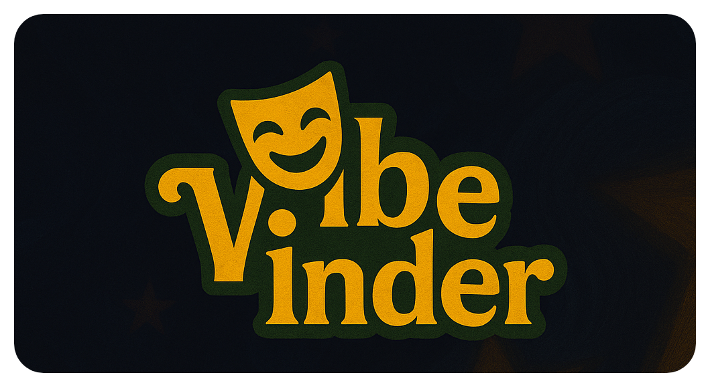

# 🎭 VibeFinder

**VibeFinder** is a mood-based movie discovery web app that blends theatrical aesthetics with real-time movie recommendations. Just select how you feel — and we’ll serve you a curated list of films to match the vibe.


<p align="center">
  
</p>

---

## 🌟 Features

- 🎬 Mood-based movie suggestions (happy, sad, angry, calm, curious, bored)
- 🌗 Dark & light theme toggle with stylish transitions
- 🧠 "Psychonauts-style" UI with dynamic background animations
- 🎭 Interactive flip cards for trailers and summaries
- 🎲 Randomized results each visit
- ❌ Adult content filtered out
- 📱 Responsive and mobile-friendly

---

## 🚀 Live Demo

Coming soon!

---

## 🛠️ Tech Stack

- **Frontend:** React, Tailwind CSS (optional), vanilla CSS animations
- **Backend:** Flask + TMDB API
- **API Source:** [The Movie Database (TMDB)](https://www.themoviedb.org/documentation/api)
- **Deployment:** GitHub Pages / Vercel (Frontend), Render / Railway (Backend)

---

## 📦 Installation

### 1. Clone the Repository

```bash
git clone https://github.com/ohad-ma/vibefinder.git
cd vibefinder
```

### 2. Fontend Setup

 ```bash
 cd client
 npm install
 npm start
```

### 3. Backend Setup
```bash
cd server
pip install -r requirements.txt
```
* Create `.env` file:
```env
TMDB_API_KEY=your_tmdb_api_key_here
```

* Then run:
```bash
py app.py
```

## ✨ Screenshots


### 🙅 Content Filtering
We filter out adult or violent content using:

* `include_adult=false`

* Targeting specific family-friendly genres (e.g., 10751)


## ❤️ Credits
Thanks to:
* TMDB
* You for vibing!
